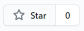
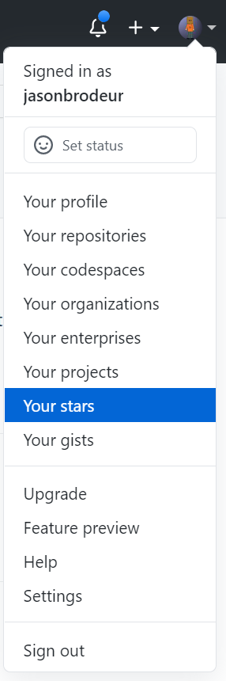

# Lesson 4: Create your project website
In this lesson, you will build upon what you learned in the previous lessons to begin assembling the project website that you will use to share all of your deliverables from this module (and this is what you'll be graded on). 

## Important Note / Update
After completing step 2 in the [*Creating your pages*](#creating-your-pages) section below to create your project GitHub repository using the provided link. Go to the main page of your new repository and click the  to star the repository. 
- This will help you find your repository later--for some strange reason, your project repository will not show up in your list of repositories
- Instead, you can find this repository in the future by clicking on your profile icon (top-right corner) and selecting to show ```Your stars```.

  

## Lesson Video
<iframe height="540" width="853" allowfullscreen frameborder=0 src="https://echo360.ca/media/026e54f7-2cd4-4774-b665-4ecc2f332b7e/public?autoplay=false&automute=false"></iframe>

## Creating your pages
Getting started is pretty easy: 
1. Ensure you are logged into your GitHub account
1. Follow [this link](https://classroom.github.com/a/_6BmxtOC) to create your project repository from a pre-made template. 
  - Once you've created it, you'll notice that all of the Markdown pages you'll need are already created, as is the _config.yml file. 
1. Edit the _config.yml file to add your own information where prompted in the file. 
1. Turn on GitHub Pages for your repository. In your GitHub repository page: 
  - Go to ```Settings > Options```, and scroll down to the bottom. Ensure that the visibility is set to ```Public```.
  - Go to ```Settings > Pages``` to turn on GitHub Pages.
    - For the **Source**, set ```Branch:main``` and set the folder to ```/(root)``` and click **Save**. This directs GitHub pages to the top-level of your repository for your website content.
1. After a minute or two, your project website will be ready. 

## Entering results from Exercise 1. 
Now that your project website is ready, you can begin populating it with your deliverables. To add your content from your Google Sheets exercise: 
1. In your GitHub repository, find and edit the google-sheets.md file. 
  - This file consists of prompts for the materials you created during Exercise 1. 
1. For each Google Sheets figure, paste in the embed code where prompted. Add your summary for each figure using Markdown. 
1. Add your final reflection where prompted. 

Going forward, you will add the rest of your deliverables to the other Markdown pages in this repository (i.e. ```tableau.md``` for your Exercise 3, and ```inquiry.md``` for your final self-directed inquiry work. 
<br>
<br>

**That's it!** You are now ready to move on to [Exercise 3](exercise3), where you're use Tableau to produce visualizations. 
