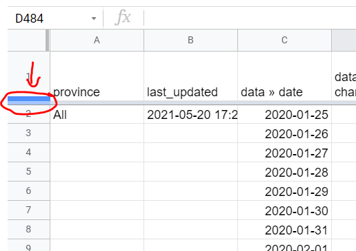

# COVID-19 Case data

## 1. Get the data 
In this lesson, we're using data from [COVID-19 Tracker Canada](https://covid19tracker.ca/index.html). The data presented on this website is compiled from a variety of Provincial/Territorial sources by [team of citizen volunteers](https://covid19tracker.ca/about.html). 

1. Scroll to the bottom of the main page, and follow links to download the data. 
  - Click [here](https://docs.google.com/spreadsheets/d/1PjkemMdFSZgA-M8Esr6rbNjHiyfcXcBxPeMjselJIso/edit#gid=669830005) for a direct link to the Google Sheet. 
1. Click ```File > Make a copy``` to save a copy of this sheet to your Google Drive -- this will be your working version for the remainder of the activities.
1. Give your Google Sheet a new name that is more understandable to you (perhaps include the name of this course in the title)

## 2. Explore the data 
1. Take a few moments to explore the various tabs/sheets that exist in the spreadsheet. Also explore the variables (columns) that are available in the sheet. 
1. If you have any questions about the data, where it comes from, or what the variables mean, head to the project site and read their [documentation](https://covid19tracker.ca/sources.html). 
1. It would be nice to have the top row (with variable names) always visible as you scroll through the data. Freeze the top row of the sheets on the screen by pulling down the horizontal grey bar at the top-left of the sheet until it rests beneath the first row.
 



There is a lot of information in this spreadsheet. Let's take a minute to list some of the variables (columns) that are available for you to explore: 
- COVID-19 cases
- COVID-19 tests
- COVID-19 hospitalizations
- COVID-19 people in critical condition
- COVID-19 recoveries
- COVID-19 vaccinations (administered, distributed)

Each of these variables are listed as a function of time -- each row is a date (defined by the column ```data >> date```).


## 3. Plot national trends in case data
Let's begin by making some straightforward plots of some of the variables in the ```National``` sheet. It's always good to start with a question, so let's begin with: 

> Q1: How has daily COVID-19 cases, hospitalizations and deaths changed in Canada over time since the beginning of the pandemic? 

- Plot the variable ```data >> change_cases``` (column D). Highlight column D (by clicking on the "D" at the top)
- Click ```Insert > Chart```, or click the chart icon .
- In the ```Setup``` pane, add the data from column C (i.e. the date) into the ```X-axis``` box. When prompted, add the data range by highlighting all rows of column C. 
- add hospitalizations (column P) and deaths (Column E) data.
- The trends in change_fatalities do not show very well, because the absolute values of this variable are much smaller than the others. Fix this by plotting deaths on its own axis (i.e. the right axis)
  - In the ```Customize``` pane, go to ```Series``` and select change_fatalities from the dropdown
  - For ```Axis```, select ```Right axis```
  - Click on the right axes and change colour to red
- Modify axes titles for all three axes. 
- Modify text labels 
- Modify font sizes
- Fix colours and markers 
- Modify Title
- Modify chart to a combo chart
  - Make the deaths a bar chart

### Inspect the trends
Inspect the trends for the three variables. Are the trends synchronized with each other? Does each variable increase the same relative amount during each of the three waves? What are some possible explanations for differences you see in the graph? What new questions do you have that could be investigated?

### Get the chart ready for export 
- Click the three dots at the top-right of the figure and select ```Publish the chart```
- Click the ```Embed``` tab. Make sure that your chart is selected (it should be by default. Note that the timeline chart may show up as having no title). Leave the chart as ```interactive```.
- Click ```Publish```, and OK at the prompt
- Copy all embed code text that shows up in the dialog box and paste it into a empty text document for later. 

## Plot Ontario's testing and vaccination trends 

> Q2: How has Ontario responded to COVID in terms of testing and vaccinations? 

- From the ```ON``` tab, plot ```data >> total_tests``` and ```data >> total_vaccinations```
- The magnitude of these numbers are very large. They're also not as illustrative as possible, since what we're really interested in is how many tests or vaccinations have been delivered per capita. We can improve this by dividing by Ontario's population and multiplying by a standard unit (like 100 or 100000). 
 
- According to [Statistics Canada quarterly population estimates](https://www150.statcan.gc.ca/t1/tbl1/en/cv.action?pid=1710000501), Ontario's population in mid-2020 was 14,734,014. This will have changed a small bit since then, but let's use this for our calculations.  

- 


vaccinations: ``` =100*(S2/14734014)```
tests: ```=100*(O2/14734014)```
## 

> Q3: How do vaccination rates over time compare between provinces and territories? 

https://www150.statcan.gc.ca/t1/tbl1/en/cv.action?pid=1710000501
 

> Q4: How do vaccination rates compare between provinces/territories right now?  


Create a table of 

