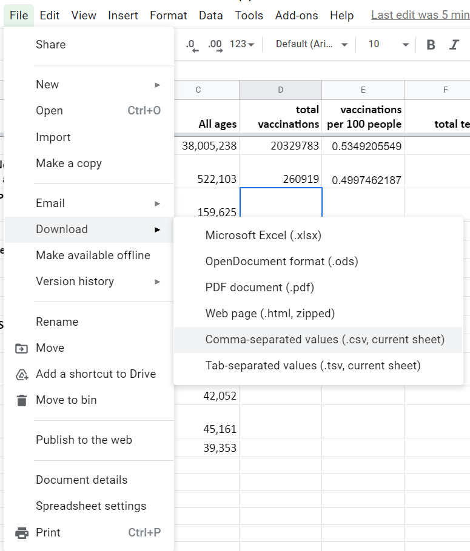

# Lesson 1: Exploring case and vaccination trends
In this exercise, we're using data from [COVID-19 Tracker Canada](https://covid19tracker.ca/index.html). The data presented on this website is compiled from a variety of Provincial/Territorial sources by [team of citizen volunteers](https://covid19tracker.ca/about.html). 

In following the steps below, you'll create a number of charts and tables in a Google Sheet. For now, these will remain in your Google Sheet. In Exercise 2, however, you will learn how to move these products into an interactive web page that you will build yourself! Follow along with the steps below

## 1. Get the data 

1. The data can be downloaded from the bottom of the main page of the COVID-19 Tracker Canada site. For the purpose of this lesson, however, the data has already been downloaded and prepared for you. 
- **Make a copy of the data you need for this exercise** [**here**](https://docs.google.com/spreadsheets/d/1-aHyxJZmN-Xuaxxt0gkHo271pHOpJI9hSJfl7OStm1A/copy). 
1. Give your Google Sheet a name that is more understandable to you (perhaps include the name of this course in the title), and save it somewhere in your Google Drive that you can find it later.

## 2. Explore the data 
1. Take a few moments to explore the various tabs/sheets that exist in the spreadsheet. Also explore the variables (columns) that are available in the sheet. 
1. If you have any questions about the data, where it comes from, or what the variables mean, head to the project site and read their [documentation](https://covid19tracker.ca/sources.html). 
1. It would be nice to have the top row (with variable names) always visible as you scroll through the data. Freeze the top row of the sheets on the screen by pulling down the horizontal grey bar at the top-left of the sheet until it rests beneath the first row.
 


There is a lot of information in this spreadsheet. Let's take a minute to list some of the variables (columns) that are available for you to explore: 
- COVID-19 cases
- COVID-19 tests
- COVID-19 hospitalizations
- COVID-19 people in critical condition
- COVID-19 recoveries
- COVID-19 vaccinations (administered, distributed)

Each of these variables are listed as a function of time -- each row is a date (defined by the column ```data >> date```).

## 3. Plot trends in national case data
Let's begin by making some straightforward plots of some of the variables in the ```National``` sheet. It's always good to start with a question, so let's begin with: 

> Q1: How has daily COVID-19 cases, hospitalizations and deaths changed in Canada over time since the beginning of the pandemic? 

1. In the ```National``` sheet, plot the variable ```data >> change_cases``` (column D). Highlight column D (by clicking on the "D" at the top)
1. Click ```Insert > Chart```, or click the chart icon  A plot of 
1. When the chart's ```Setup``` pane appears, make a few modifications: 
  - Modify the value in the ```Data range``` box to include all data in the sheet (```A1:Y484```). This will save us some time later. 
  - Click the ```X-axis``` box and add the ```data >> date``` variable (i.e. Column C). This will add dates to the bottom of the figure. - add hospitalizations (column P) and deaths (Column E) data.
  - In the ```Series``` section, add the variables: ```data » change_fatalities``` (Column E) and ```data » total_hospitalizations``` (Column P).
  
1. The trends in ```data >> change_fatalities``` do not show very well, because the absolute values of this variable are much smaller than the others. Fix this by plotting deaths on its own axis (i.e. the right axis)
  - In the ```Customize``` pane, go to ```Series``` and select ``` data >> change_fatalities``` in the dropdown.
  - For ```Axis```, select ```Right axis```
1. To help the viewer understand that the right axis corresponds to fatalities, change the colour of the axis labels to red and provide an axis label. 
  - Click on the right axes in the figure to bring up the ```Customize > Right vertical axis``` options. Change the ```Text colour``` to red.
  - Go to ```Customize > Chart and axis title > Right vertical axis title``` and provide the title text ```Fatalities```
1. (optional) If you would like to experiment with presenting one/some of the variables differently, in ```Setup > Chart type``` select ```Combo chart```.
  - This will change one series to a bar graph by default. You can change which series is presented as a bar in ```Customize > Series``` by selecting one of the series and changing the ```Type``` between ```Columns``` and ```Area```.
1. Finally, modify the elements of the figure to improve its presentation. This can be done by clicking on the part of the chart and editing in the ```Customize``` pane.
  - Add and/or modify all axis titles 
  - Modify text labels 
  - Modify font sizes
  - Edit colours and markers for time series.
  - Add/modify the chart title
  - Add/modify vertical and horizontal grid lines.

### Inspect the trends
Inspect the trends for the three plotted variables. Are the trends synchronized with each other? Does each variable increase the same relative amount during each of the three pandemic waves? What are some possible explanations for differences you see in the graph? What new questions do you have that could be investigated?

### Get the chart ready for export 
- Click the three dots at the top-right of the figure and select ```Publish the chart```
- Click the ```Embed``` tab. Make sure that your chart is selected (it should be by default. Note that the timeline chart may show up as having no title). Leave the chart as ```interactive```.
- Click ```Publish```, and OK at the prompt
- Copy all embed code text that shows up in the dialog box and paste it into a empty text document for later. 

## 4. Plot Ontario's testing and vaccination trends 

> Q2: How has Ontario responded to COVID in terms of testing and vaccinations? 

- From the ```ON``` tab, plot ```data >> total_tests``` and ```data >> total_vaccinations```
- The magnitude of these numbers are very large. They're also not as illustrative as possible, since what we're really interested in is how many tests or vaccinations have been delivered per capita. We can improve this by dividing by Ontario's population and multiplying by a standard unit (like 100 or 100000). 
 
- According to [Statistics Canada quarterly population estimates](https://www150.statcan.gc.ca/t1/tbl1/en/cv.action?pid=1710000501), Ontario's population in mid-2020 was 14,734,014. This will have changed a small bit since then, but let's use this for our calculations. You can also find this value in the ```Provincial Summary``` tab of your Google Sheet.  

### Convert total test and vaccination values to per 100
- Convert ```data » total_vaccinations``` (column S) to vaccinations per 100 in Column V of the ```ON``` sheet:
  - In the first row of Column V, give the column a title ```vaccinations per 100 people```
  - In row 2 of Column V, enter the formula```=100*(S2/'Provincial Summary'!$C$8)```
    - **Note** that the reference to the Ontario Population Provincial Summary value has ```$``` before the column and row reference. Doing this keeps the reference value from changing when the formula is dragged to other cells.
	- **Note2** also notice above that when you are referring to cells in another sheet, you have to write the name of that sheet and add a ```!``` afterwards to instruct Google Sheets to look in a different sheet (otherwise, it will refer to the current one). In this case, we refer to cell C8 in the Provincial Summary sheet as ```'Provincial Summary'!$C$8```.
  - Copy the function down to all rows of Column V
- In Column W, complete the same for task for ```data » total_tests``` (Column O). Give the column the title ```tests per 100 people```

### Revise your figure
- Go back to the ```Setup``` pane of your figure. Remove the two previously plotted time series.
- Add the two new time series (columns V and W).
  - The easiest way to adjust this is to change the ```Data range``` to the full extent of the data (i.e. ```A1:Y484``` in this case). Then, click in the ```Series``` box and select the two variables you wish you plot. **Note** that you may need to reselect your X-axis (i.e. ```data >> date```), as well. Make sure that ```Use column C as labels``` is selected.

### Style your figure
- As with the previous chart, style this figure to improve its clarity and ensure that it aligns as closely as possible with the response to the original question.
  
### Get the chart ready for export 
- Click the three dots at the top-right of the figure and select ```Publish the chart```
- Click the ```Embed``` tab. Make sure that your chart is selected (it should be by default. Note that the timeline chart may show up as having no title). Leave the chart as ```interactive```.
- Click ```Publish```, and OK at the prompt
- Copy all embed code text that shows up in the dialog box and paste it into a empty text document for later.

### Inspect the trends
In a couple of sentences, summarize the trends in Ontario's COVID testing and vaccination rollout.

## 5. Calculate and plot vaccination rates for all regions

> Q3: How do vaccination rates over time compare between all provinces and territories? 

For this one, you need to reproduce the ```vaccinations per 100 people``` calculations that you completed previously to each Province and Territory. This work has been started for you in the ```Vax per 100``` sheet. Your task is to: 
1. Complete the calculations for each Province and Territory in the ```Vax per 100``` sheet (note, you'll be referring to data in each of the Province/Territory sheets, as well as the ```All ages``` column of the ```Provincial Summary``` sheet. 
1. Add all of this data to a chart. For ```Chart type```, select ```Timeline chart```. This creates an interactive time-based visualization of values for each of the time series. 
1. Style the figure to make it clear and relevant to the question being asked.
1. Publish the figure. 

### Inspect the trends
In a couple of sentences, summarize the trends shown in the chart. Are there discrepancies between Provinces/Territories? If so, what might be the explanation for these? 

## 6. Compare current state of vaccinations across regions

> Q4: What is the current state of vaccinations between provinces and territories right now?  

In this analysis, you are going to create a **table** of ```vaccinations per 100 people``` values as they currently stand for each Province and Territory. Essentially, this will be a table version of the last points in the previously-created figure. 

A table has been started for you in the ```Provincial Summary``` sheet. Your task is to: 
1. Complete the calculations that have been started for you. You can also perform the same calculation for tests (this is optional, though you may want to use it for later analyses).
1. When completed, save the ```Provincial Summary``` sheet to a comma-separated values (csv) file. Save it to a directory for this module. You will use this file in the [Tableau Exercise](exercise3) to make a neat [choropleth map](https://www.arcgis.com/apps/MapJournal/index.html?appid=75eff041036d40cf8e70df99641004ca)!
  - To save the file as a csv, click ```File > Download > Comma-separated values (.csv, current sheet)```
  

**All finished?** Head to [lesson 2](google-sheets2) to explore a different COVID-related dataset. 