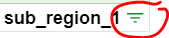

# Exploring mobility trends
In this lesson, we'll be working with [Google Community Mobility Report data](https://www.google.com/covid19/mobility/). These datasets are compiled by Google from location-based apps (like Google Maps), and the purpose is: 
> ... to provide insights into what has changed in response to policies aimed at combating COVID-19. The reports chart movement trends over time by geography, across different categories of places such as retail and recreation, groceries and pharmacies, parks, transit stations, workplaces, and residential.

We can use this data to explore Canadians' changing activities during various stages of the pandemic and in different regions of the country. In your final exercise, you'll be asked to think about ways that this data can be combined with case and vaccination data (from the last lesson) to produce greater insight of the interplay between public policy, citizen behaviour, and COVID-19 cases and fatalities. 

**Note** that we're only going to do a bit of analysis on this dataset--the rest will be carried out in Tableau during [Exercise 3](exercise3).

## 1a. Get the data

### The easy way (recommended)
**Note** that this data has already been downloaded and prepared for you in a Google Sheet. Click [here](https://docs.google.com/spreadsheets/d/1B6Ear2sZ890amEHA-JVVtbZnfxzDkorj0gP7B_7lSdY/copy) to make a working copy of this data. 

## 1b. The hard way (totally optional)
**Completely Optional**: If you would like to try to the Google Sheet on your own using the Community Mobility Report data, follow the steps below: 
1. Download the ```Region CSVs``` file from the [Google Community Mobility Report data](https://www.google.com/covid19/mobility/) site. Unzip it. 
1. Use a text editor (I recommend [Notepad++](https://notepad-plus-plus.org/downloads/v7.9.2/) to open the 2020 and 2021 Canadian files (```2020_CA_Region_Mobility_Report``` and ```2021_CA_Region_Mobility_Report```).
1. Copy the data values (i.e. everything but the top row) of the 2021 sheet to the bottom of the 2020 sheet. 
1. On the combined file, change the encoding to **UTF-8 BOM** (see screenshot below). This is necessary to make accented characters display properly in Google Sheets.  


1. Save your combined mobility file.   
1. Create a new Google Sheet. Give it an appropriate name (e.g. INSPIRE-PIP-Mobility)
1. Go to ```File > Import``` and upload the combined mobility file. 
1. In the Import File box, select the following: 
  - ```Import location``` : ```Replace spreadsheet```
  - ```Separator type``` : ```Detect automatically```
  
1. Click ```Import data```
1. Rename the sheet/tab to ```All Data```

## 1. Explore the data
- Take a few minutes to explore the data in the Google Sheet. Refer to the [documentation](https://support.google.com/covid19-mobility/answer/9824897?hl=en&ref_topic=9822927) to better understand how this data has been collected, derived, and presented, and to begin considering any limitations or weaknesses this data set may have. 
- Freeze the top row so you can scroll through the data easier. 
- What is being represented in columns J thru O? 
  - Each shows a percent change in occupancy (from the pre-COVID baseline) for six different categories of places (retail and recreation, grocery and pharmacy, parks, etc.).
  - How might the information in this spreadsheet be informative or useful? 

### Filtering data   
- How does the structure of the data in this Google Sheet compare to the Cases and Vaccinations Google Sheet you worked with in Exercise 1? 
- To explore the data more, click on the filter button  to turn on filters for each column. It may need a second to work, but you have been successful when column filters appear as green inverted triangle icons in the top row of each column. e.g., . 
  - For the columns ```sub_region_1``` and ```sub_region_2```, click the column filter and explore the unique values presented in the filter box.
    - What information are each of these columns presenting? 
  - Do the same for the ```date``` column. This time, click ```Clear``` to uncheck all values in the filter box list. Recheck a single date (e.g. ```2020-02-15```). Click OK. 
    - The Google Sheet now displays only rows with the checked value(s) in the ```date``` column. 
    - Is there a single row for each date (like in the Cases and Vaccinations lesson), or are there multiple ones? If there are multiple, what differs between the rows? 
  - Click the filter symbol  again to turn off filters and bring back all rows.

### Long vs wide data
- In the Mobility data the independent variable (time) repeats for different combinations of other variables (e.g. ```sub_region1```, ```sub_region_2```). This differs from the Cases and Vaccinations data, where each date appears once and the values of all other variables at that time are captured in additional columns. 
- The Mobility data is what is known as [**long data**](https://www.theanalysisfactor.com/wide-and-long-data/), while the Cases and Vaccinations data is structured as **wide data**. Wide data is easier to work with in spreadsheets. 
- In its current state, we can't just plot the Mobility data as a time series like we did the Cases and Vaccinations data. Instead, we need to use ***Pivot Tables*** to convert the long data into wide data. We'll do this in your first task. 

## 2. Canadian mobility trends

> Q1. How has mobility changed in Canada over the pandemic 

In this analysis, you'll create an interactive Timeline chart that shows changes in cross-Canada mobility for all 6 place types. 

### Create a Pivot Table
We'll use the ***Pivot Table*** function in Google Sheets to pull out only Canada-wide data from the ```All Data``` sheet (i.e. rows where there is no value for ```sub_region1``` and ```sub_region_2```).
1. From the ```All Data``` sheet, press ```Ctrl + A``` to select all non-empty cells. 
1. Click on ```Data > Pivot Table```. Choose to insert it into a new sheet.  
  
1. In the **Pivot table editor** that appears in the new sheet, make the following selections:
 
|Element|Value|
|:---|:---|
|Rows|1. Add ```date``` <br> 2. Uncheck ```Show totals```|
|Columns| *leave empty* |
|Values| Add each of the following in succession (keep all summarized by SUM): <br> 1. ```retail_and_recreation_percent_change_from_baseline``` <br> 2. ```grocery_and_pharmacy_percent_change_from_baseline``` <br> 3. ```parks_percent_change_from_baseline``` <br> 4. ```transit_stations_percent_change_from_baseline``` <br> 5. ```workplaces_percent_change_from_baseline``` <br> 6. ```residential_percent_change_from_baseline```|
|Filters| 1. Add ```sub_region_1``` <br> 2. In the **Status** dropdown, select only ```(Blanks)```|

  

5. Rename the new sheet containing the pivot table. Give it a distinguishing name (e.g. ***Canada mobility***)
6. Highlight cells B1 to G1, and use the *wrap text* button to wrap text to make it more readable.
7. Rename each variable name (in row 1 of the sheet) to make it more readable. e.g.: 
  - In cell B1, rename ```SUM of retail_and_recreation_percent_change_from_baseline``` to ```retail and recreation```
  - rename ```SUM of grocery_and_pharmacy_percent_change_from_baseline``` to ```grocery and pharmacy```
  - etc.

## Create the timeline chart
- From the top bar, click on ```Insert > Chart``` 
- In the ***Chart Editor***, select the ```Chart type``` to be *Timeline*
- For ```Data range``` highlight the full extent of the data (including the first header row with variable names, e.g. A1:G453 in this example).
- Check ```Use row 1 as headers```
- Make sure ```Use column A as labels``` is checked.

## Customize the chart
*Note: There is not much customization that you can do on a Timeline chart*
- Ensure that the ***Chart Editor*** is still open. If it isn't, double-click the chart to open it.
- In the ```Customize``` tab of the ***Chart Editor***, experiment with changing the ```Fill opacity```, ```Line thickness```, and ```Date format```. 

### Publish the figure to embed it in a webpage
- Click the three dots at the top-right of the figure and select ```Publish the chart```
- Click the ```Embed``` tab. Make sure that your chart is selected (it should be by default. Note that the timeline chart may show up as having no title). Leave the chart as ```interactive```.
- Click ```Publish```, and OK at the prompt
- Copy all embed code text that shows up in the dialog box and paste it into a empty text document for later. e.g.:
```
<iframe width="1000" height="464" seamless frameborder="0" scrolling="no" src="https://docs.google.com/spreadsheets/d/e/2PACX-1vT0QsBupeGwVggn9tHtI9MtlK9L9dQBbc9Hk7cjbSXR0u3CYAM2YpS6RTyCGhx33mK1cASl0hrnjyFT/pubchart?oid=1084506432&amp;format=interactive"></iframe>
```
When the copied html embed code is inserted into a webpage (that's coming soon), you'll end up with an interactive chart that looks something like this:  

<iframe width="800" height="464" seamless frameborder="0" scrolling="no" src="https://docs.google.com/spreadsheets/d/e/2PACX-1vT0QsBupeGwVggn9tHtI9MtlK9L9dQBbc9Hk7cjbSXR0u3CYAM2YpS6RTyCGhx33mK1cASl0hrnjyFT/pubchart?oid=1084506432&amp;format=interactive"></iframe>

# Exercise 2 - Provincial comparison

## Create a pivot table 

From the ```All Data``` tab, create a new pivot table (```>Data>Pivot Table```). Insert it into a new sheet.  
  

In the **Pivot table editor**, make the following selections:

|Element|Value|
|:---|:---|
|Rows|1. Add ```date``` <br> 2. Uncheck ```Show totals```|
|Columns| 1. Add ```sub_region_1``` <br> 2. Keep ```Show totals``` checked|
|Values| Add ```retail_and_recreation_percent_change_from_baseline``` <br> 2. Summarise by SUM |
|Filters| 1. Add ```sub_region_2``` <br> 2. In the **Status** dropdown, select only ```(Blanks)```|

- The resulting table should now have a column for each Province/Territory. 
  - **NOTE:** Column B (without a title) is the Canadian average. 
- Rename the new sheet containing the pivot table. Give it a distinguishing name (e.g. ***Provincial Comparison***)

## Create a Line Chart

- From the top bar, click on ```Insert > Chart``` 
- By default, a **Line Chart** is created using the full Data range (e.g. A1:O454)
- In the ***Chart Editor*** ***Setup*** tab:
  - Edit ```Data range``` to ```A2:O454``` (i.e. exclude the first row)
  - Remove most of the series (click the three dots and select ```Remove```) until you are left with the ones you want to compare (e.g. Canada, Alberta, Ontario, Nova Scotia). 


## Style the chart 
The line chart is fairly informative now, but it's not quite ready to publish
- Some axes labels are missing
- The title needs to be fixed
- The "Canada" series isn't labeled in the legend.
- The time series are spiky and noisy, and it's hard to focus on general trends.


- Note that the Canada Series has no name in the legend. Double-click on the Canada line in the legend to show the ```Text formatting``` tab. For ```Text label``` enter ```Canada```

  


- In the ***Chart Editor***, select the ```Chart type``` to be *Timeline*
- For ```Data range``` highlight the full extent of the data (including the first header row with variable names, e.g. A1:G453 in this example).
- Check ```Use row 1 as headers```
- Make sure ```Use column A as labels``` is checked.

## Customize the chart
*Note: There is not much customization that you can do on a Timeline chart*
- Ensure that the ***Chart Editor*** is still open. If it isn't, double-click the chart to open it.
- In the ```Customize``` tab of the ***Chart Editor***, experiment with changing the ```Fill opacity```, ```Line thickness```, and ```Date format```. 

### Publish the figure to embed it in a webpage
- Click the three dots at the top-right of the figure and select ```Publish the chart```
- Click the ```Embed``` tab. Make sure that your chart is selected (it should be by default. Note that the timeline chart may show up as having no title). Leave the chart as ```interactive```.
- Click ```Publish```, and OK at the prompt
- Copy all embed code text that shows up in the dialog box and paste it into a empty text document for later.


# Exercise 3 - Ontario county comparison

* Create new pivot table (```>Data>Pivot Table```). Insert it into a new sheet.  
  

* For **Rows**, select the ```date``` column. Uncheck *Show totals*.
* For **Columns**, select the ```sub_region_2``` column. Uncheck *Show totals*.
* For **Values**, add the ```retail_and_recreation_percent_change_from_baseline``` column.
* For **Filters**, add the ```sub_region_1``` column. In the **Status** dropdown, make sure only ```Ontario``` is checked.  

Text wrapping

- Add chart
- Data range: A2:BA454
- X-axis: ```date```
- Click ```Add Series```
  - Select a few regions to plot (e.g. Chatham-Kent, Hamilton, Region of Peel, Greater Sudbury)
  - 
  
Customize > Series > 

Click to add a Trend Line
- **Average type**: ```Centred```
- **Period**: ```10```
- **Line opacity**: ```80```
- **Line thickness**: ```4```

In the **Format** section above
- **Line Opacity**: ```30%```

In the **Chart and axis titles** section, 
- Select **Chart title** in the dropdown to name the graphic. 
  - Give the graphic a name (e.g. "Retail and recreation mobility - selected counties"). Centre the title.
- Now select **Horizontal axis title**, change it to "Date". Increase font size to 16 points
- Now select **Vertical axis title**, change it to "% change from pre-COVID baseline". Increase font size to 16 points

In the **Horizontal axis** section, change the ```Label font size``` to 14.

Publish the chart
- Click the three dots at the top-right of the figure and select ```Publish the chart```
- Click the ```Embed``` tab. Make sure that your chart is selected (it should be by default). Leave the chart as ```interactive```
- Click ```Publish```, and OK at the prompt
- Copy all embed code text that shows up in the dialog box and paste it into a empty text document for later. e.g.:
```
<iframe width="1031" height="637" seamless frameborder="0" scrolling="no" src="https://docs.google.com/spreadsheets/d/e/2PACX-1vT0QsBupeGwVggn9tHtI9MtlK9L9dQBbc9Hk7cjbSXR0u3CYAM2YpS6RTyCGhx33mK1cASl0hrnjyFT/pubchart?oid=1991365340&amp;format=interactive"></iframe>
```

## Provincial summaries
* Create new pivot table (```>Data>Pivot Table```). Insert it into a new sheet.  
  

- In the Pivot Table Editor, set the following values:  

|Element|Value|
|:---|:---|
|Rows|1. select ```sub_region1``` <br> 2. uncheck ```Show totals```|
|Columns| leave empty|
|Values| 1. select ```retail_and_recreation_percent_change_from_baseline```<br> 2. Summarise by AVERAGE|
|Filters| 1. Select ```sub_region_2``` <br> 2. Select only ```(Blanks)```|


# Tableau
Sign up for Tableau at: https://www.tableau.com/academic/students#form
