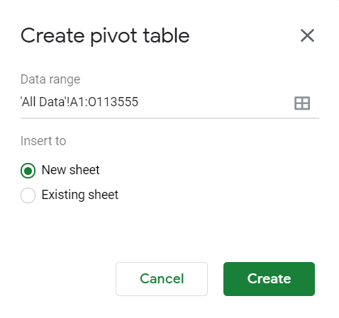

# Extra Stuff
This page contains additional examples for creating pivot tables and charts from the Mobility data. 

## 1. Provincial comparison

> Q: How have mobility trends differed over time between regions of Canada? 

### Create a pivot table 
1. From the ```All Data``` tab, select all data (```Ctrl + A```) and click ``` > Data > Pivot Table``` to create a new pivot table. Insert it into a new sheet.  
  

2. In the **Pivot table editor**, make the following selections:

|Element|Value|
|:---|:---|
|Rows|1. Add ```date``` <br> 2. Uncheck ```Show totals```|
|Columns| 1. Add ```sub_region_1``` <br> 2. Keep ```Show totals``` checked|
|Values| Add ```retail_and_recreation_percent_change_from_baseline``` <br> 2. Summarise by SUM |
|Filters| 1. Add ```sub_region_2``` <br> 2. In the **Status** dropdown, select only ```(Blanks)```|

**Note** that selecting only rows where ```sub_region_2``` is blank means that we're collecting Province/Territory averages only (and not municipalities). 

3. The resulting table should now have a column for each Province/Territory. 
  - **NOTE:** Column B (without a title) is the Canadian average. Unfortunately, you can't add this title into cell B2.
4. Rename the new sheet containing the pivot table. Give it a distinguishing name (e.g. ***Provincial Comparison***)

### Create a Line Chart
- From the top bar, click on ```Insert > Chart``` 
- By default, a **Line Chart** is created using the full Data range (e.g. A1:O454)
- In the ***Chart Editor*** ```Setup``` pane:
  - Edit ```Data range``` to ```A2:O462```. This excludes the first row so that you can check ```Use row 2 as the headers```).
  - Remove most of the series (click the three dots and select ```Remove```) until you are left with the ones you want to compare (e.g. Canada, Alberta, Ontario, Nova Scotia). 

### Style the chart 
The line chart is fairly informative now, but it's not quite ready to publish. Fix up a few elements:
- Some axes labels are missing
- The title needs to be adjusted
- If you've plotted the *Canada* Series, it will have no name in the legend. Double-click on the Canada line in the legend to show the ```Text formatting``` tab. For ```Text label``` enter ```Canada```
  


### Replace noisy data with moving averages
The time series are spiky and noisy (why do you think the data is noisy?), and it's hard to focus on general trends. We can create smoothed moving average trend lines for each time series and display those more prominently. Once we have created the smoothed lines, we'll also want to make the actual time series data less prominent.
1. Go to ```Customize > Series```. 
2. Create trend lines for all series at once: 
  - With ```Apply to all series``` selected in the dropdown, check ```Trendline```
  - For ```Type```, select ```Moving Average```. 
  - For ```Average type```, select ```Centred```
  - For ```Period```, select ```6``` or ```8```, noting that a higher period makes for a smoother line.
  - Set the ```Line Opacity``` to ```80%``` and the ```Line Thickness``` to ```4px```
3. Reduce visibility of original data. With ```Apply to all series``` selected in the ```Customize > Series``` pane:
  - Change ```Line Opacity```	to ```20%``` (or something similarly small).

### Publish the figure to embed it in a web page
- Click the three dots at the top-right of the figure and select ```Publish the chart```
- Click the ```Embed``` tab. Make sure that your chart is selected (it should be by default. Note that the timeline chart may show up as having no title). Leave the chart as ```interactive```.
- Click ```Publish```, and OK at the prompt
- Copy all embed code text that shows up in the dialog box and paste it into a empty text document for later.


## 2. Mobility trends among Ontario counties/municipalities
> Q: How have mobility trends differed over time between counties/municipalities of Ontario? 

### Create a pivot table
1. From the ```All Data``` tab, select all data (```Ctrl + A```) and click ``` > Data > Pivot Table``` to create a new pivot table. Insert it into a new sheet.  
  

2. In the **Pivot Table Editor**, set the following values:  

|Element|Value|
|:---|:---|
|Rows|1. select ```date``` <br> 2. uncheck ```Show totals```|
|Columns|1. select ```sub_region_2``` <br> 2. uncheck ```Show totals```|
|Values| 1. select ```retail_and_recreation_percent_change_from_baseline```<br> 2. Summarise by AVERAGE|
|Filters| 1. Select ```sub_region_1``` <br> 2. Select only ```Ontario``` in the *Status* dropdown|

**Note** that selecting only rows where ```sub_region_1``` is ```Ontario``` means that it will return the Ontario average values and values for each county/municipality in Ontario. 

3. The resulting table should now have a column for each county/municipality 
  - **NOTE:** Column B (without a title) is the Ontario average. Unfortunately, you can't add this title into cell B2.
4. Rename the new sheet containing the pivot table. Give it a distinguishing name (e.g. ***Ontario Comparison***)

### Plot, style, publish
- Follow the steps outlined for the Province/Territory example above to create a publishable figure. 

## 3. Province/Territory summary table
In this example, we'll create a table that shows the average mobility for each province/territory during the entire COVID-19 period for each of the 6 destination types. 

### Create a pivot table
1. From the ```All Data``` tab, select all data (```Ctrl + A```) and click ``` > Data > Pivot Table``` to create a new pivot table. Insert it into a new sheet.  

2. In the **Pivot Table Editor**, set the following values:  

|Element|Value|
|:---|:---|
|Rows|1. select ```sub_region1``` <br> 2. uncheck ```Show totals```|
|Columns| leave empty|
|Values| 1. select ```retail_and_recreation_percent_change_from_baseline``` and Summarise by AVERAGE <br> 2. select ```grocery_and_pharmacy_percent_change_from_baseline``` and Summarise by AVERAGE <br> 3-6. repeat for the other 4 destination types.|
|Filters| 1. Select ```sub_region_2``` <br> 2. Select only ```(Blanks)```|

3. Rename the new sheet containing the pivot table. Give it a distinguishing name (e.g. ***Canada mobility***)
4. Highlight cells B1 to G1, and use the *wrap text* button to wrap text to make it more readable.
5. Rename each variable name (in row 1 of the sheet) to make it more readable. e.g.: 
  - In cell B1, rename ```SUM of retail_and_recreation_percent_change_from_baseline``` to ```retail and recreation```
  - In cell C1, rename ```SUM of grocery_and_pharmacy_percent_change_from_baseline``` to ```grocery and pharmacy```
  - etc.

6. To use this table in another program, you can save it as a csv or other format file using ```File > Download```.