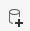
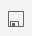

# Getting started with Tableau
In this exercise, you'll use the COVID-19 data from Exercise 1 (Cases and Vaccinations; Mobility) to learn some of the basics of uploading, manipulating, analyzing, and plotting data in Tableau. 

## 1. Create a choropleth map of regional vaccination data 

In this example, you will revisit Question 4 from [first lesson](google-sheets1) of your Google Sheets Exercise by uploading the ```provincial-vaccinations.csv``` table that you created into Tableau and creating a [choropleth map](https://www.arcgis.com/apps/MapJournal/index.html?appid=75eff041036d40cf8e70df99641004ca) that shades each province or territory with a different colour depending on the number of vaccinations given per 100 people.

From the previous exercise: 
> Q1: What is the current state of vaccinations among provinces and territories?  

### Connect to your data
1. From the start page, click to connect ```To a File > Text file```
  - If you are on the main interface page, first click ```Connect to Data``` or the *New Data Source* button . 
1. Navigate to your ```provincial-vaccinations.csv``` file and Open it. 
1. Preview your data in the **Data Source** tab. Note that Tableau has interpreted: 
  - That the first row consists of variable names.
  - The type of variable for each column (there is a text ```Abc``` symbol above the ```Region``` column, and a numeric symbol ```#``` above the others. 
  
### Dimensions vs Measures
Tableau separates variables into two types: Dimensions and Measures. From [Tableau help](https://help.tableau.com/current/guides/get-started-tutorial/en-us/get-started-tutorial-drag.htm):
> ***Dimensions*** are qualitative data, such as a name or date. By default, Tableau automatically classifies data that contains qualitative or categorical information as a dimension, for example, any field with text or date values. These fields generally appear as column headers for rows of data, such as Customer Name or Order Date, and also define the level of granularity that shows in the view.
> ***Measures*** are quantitative numerical data. By default, Tableau treats any field containing this kind of data as a measure, for example, sales transactions or profit. Data that is classified as a measure can be aggregated based on a given dimension, for example, total sales (Measure) by region (Dimension).

### Create a choropleth map 
As stated above, let's create a choropleth map](https://www.arcgis.com/apps/MapJournal/index.html?appid=75eff041036d40cf8e70df99641004ca) that shades each province or territory with a different colour depending on the number of vaccinations given per 100 people.
1. At the bottom-left, click to open a blank **Sheet** or create a new one. 
1. From the **Tables** pane on the left, click the dropdown triangle to the right of the ```Region``` dimension. Click ```Geographic Role > State/Province```. This informs Tableau to interpret the region names to be State or Provincial ones, which will (hopefully) assign values to the region of the world that we intend.
  - Note that once this is done, two additional Measures are created: ```Latitude``` and ```Longitude``` -- these relate the ```Region``` dimension to the real-world spatial coordinates of their boundaries.
1. In the **Data** panel, hold the ```Ctrl``` or ```Cmd``` key and select both ```Region``` and ```Vaccinations per 100 people```.
1. On the right **Show Me** panel, click to create a type **Map**. 
1. Congratulations, you should now see a map of Canada with each province and territory highlighted in a certain colour. Hover over each region to see the information that appears in the pop-up box. 

### Scrutinize your visualization
Not all visualizations are created equal. Just because a chart or map makes sense to you (or has been suggested by sophisticated software) doesn't mean that it will be effective in communicating your message to the intended audience. When creating a visualization, here are a few key considerations to keep in mind:
1. **What is your message?** What information are you trying to communicate to your audience? If you had to summarize the 'point' of the figure in two sentences, what would it be? Keep your message in mind while you design your visualization. 
1. **Who is your intended audience?** For whom are you making this visualization? What do they already understand about the topic or the information that you are presenting? What is the best way to communicate with them?
1. **What is the context?** Where is this visualization being presented? What additional information is being presented alongside it (in the same article, website, etc.)? How much contextualizing information do you need to provide so that the visualization 'stands on its own'?
1. **How will visual elements be interpreted?** The way in which humans interpret visual elements depends on a combination of basic cognitive responses, as well as learned behaviour. As such, it's important to consider that interpretations or responses to visualizations can differ between communities and cultures. For example, think about how the colour red is commonly interpreted: How might the use of red affect the way a visualization is interpreted? 
1. **How can you maximize clarity?** Clarity over content. Your goal when creating a visualization is to convey your message using only the elements that are necessary. This will vary depending on the nature of your *message*, the *intended audience*, the *context*, and the *visual elements* you are using. Approach your visualizations a bit like Marie Kondo: *If an element of your figure does not add to the intended message, simplify it or remove it altogether*. 
<br>
<br>

What are your first impressions of the choropleth? Does it answer the initial question? Will an external audience member understand what this visualization is showing? Does the current choropleth communicate the differences in vaccination rates between provinces and territories?  
<br>
Take a minute to review the considerations listed above and check out the University of Guelph Library's [visualization design consideration page](https://guides.lib.uoguelph.ca/c.php?g=700755&p=4976239). Does this give you any ideas on how to make your graphic better? 

### Style your map
There isn't as much to style in a choropleth map as compared to a line chart or other type of visual. Mostly, we'll focus on how colour is used to convey information, and the map elements that are included. 
1. Edit the colours of the choropleth to find a suitable colour palette and make the differences between the regions more distinguishable.
  - In the **Marks** pane, click ```Color > Edit Colors```.
    - Experiment with different colour palettes. What is an appropriate colour scale for this kind of information?
	- You can also experiment with opacity of the map layer. How much of the underlying basemap do you want to show through? 
    - Regardless of the palette you use, you will probably observe that there is not much variability being shown between the provinces. Since the territories have a much higher rate of vaccination than the provinces, most of the colour range is unused between them and the lower-valued provinces. You can change this by adjusting the values at which the colour range is at its minimum and maximum. 
      - Click ```Advanced``` and edit the ```End``` of the colour range to be something around 80 -- this will show the differences between provinces better (at the expense of making all of the territories the same colour). 
  - Click ```OK```.
1. You can edit the content of the pop-up window that shows when the user hovers over a region. To do this, in the **Marks** pane, click ```Tooltip```, and use the editor to change the tooltip appearance, add, or remove content.
1. To change the basemap that is displayed underneath your data layer, on the top toolbar click ```Map > Background Maps``` and select one that is desirable. 
1. You can also select which [elements](https://www.gislounge.com/whats-in-a-map/) are included on your map by clicking ```Map > Map Options```:
  - Check ```Show Map Scale```, and change the ```units``` to ```metric```. 

### Create a dashboard
You can publish your figure (and allow it to be placed into your project website) by inserting it into a dashboard. A dashboard allows you to fine-tune the presentation of your visualization and add additional contextualizing elements to it.
1. On the top toolbar, click ```Dashboard > New Dashboard```
1. In the Dashboard builder window, drag the **Sheet** with your choropleth onto the dashboard canvas. 
1. The map will appear with the associated colour bar. You can move these elements around to make better use of space.
  - Drag the colour bar beneath the map, so that they are stacked on top of each other. This maximizes the space for the map.
1. Edit the title of the map to something like *Vaccinations per 100 people, 21-May, 2021.*
1. Use the ```Objects``` panel to add additional information to the map. 
  - Add a text box to the bottom of the dashboard (note that you can resize it to take up minimal space). Add some text referring to the source of the data: *Data source: COVID-19 tracker Canada. covid19tracker.ca*. 
1. From the **Dashboard** pane, you can also adjust the size of your map, if desired.
  
### Publish the dashboard
1. When you are ready to publish your dashboard, click on the **Save the Tableau Public** button . Give the dashboard a unique and descriptive name. You may be prompted to log into your Tableau account.
1. When published, your dashboard should load in the browser (or you can find it in your Tableau Public profile). It will have a URL similar to ```https://public.tableau.com/profile/jason.brodeur#!/vizhome/jbrodeur-vax-rates/Dashboard1?publish=yes```. 

### Embed your visualization in your GitHub Pages project page
As demonstrated in [Exercise 2](excercise2), you can insert html code into a markdown file to embed web content. With thanks to [San Wang](https://san-wang.github.io/blog/Embed-Tableau-dashboard-into-github-page-post/) for the guidance, you can do the same with your Tableau dashboard.
1. Insert the following code into your Markdown file where you would like it to appear: 

```
<iframe seamless frameborder="0" src="https://public.tableau.com/views/jbrodeur-vax-rates/Dashboard1?:embed=yes&:display_count=yes&:showVizHome=no" width = '650' height = '650' scrolling='no'></iframe> 
```

  - **Note** that the only unique part of the URL is ```jbrodeur-vax-rates/Dashboard1```, which is the name of the dashboard itself. 
  - **Note2:** I suggest always leaving a blank line in your Markdown file above and below the html code. 
2. Replace the ```jbrodeur-vax-rates/Dashboard1``` part of the URL with the values from your dashboard's URL. 
3. Commit changes. Wait for the changes to propagate to your GitHub Pages website and inspect. 
<br>
This should result in an interactive map that looks something like this: 

<iframe seamless frameborder="0" src="https://public.tableau.com/views/jbrodeur-vax-rates/Dashboard1?:embed=yes&:display_count=yes&:showVizHome=no" width = '650' height = '650' scrolling='no'></iframe> 

<br>
<br>
**Finished?** Head to [lesson 2](tableau2) to create some other kinds of charts using your Mobility data. 
